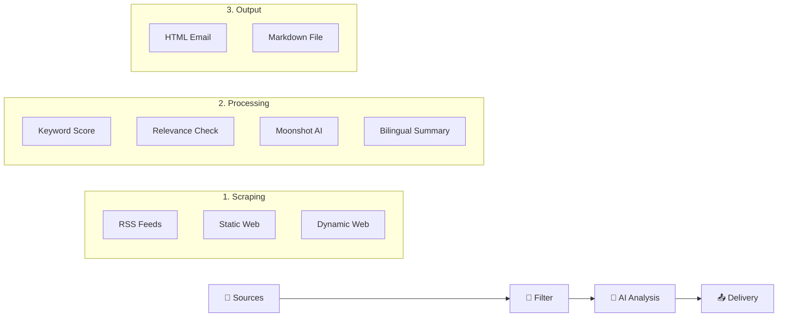

[🇨🇳 中文文档](#中文介绍) | [🇬🇧 English Documentation](#english-documentation)

---

## <a id="中文介绍"></a>🇨🇳 中文介绍

**Industrial AI & Simulation Intelligence System** 是一个自动化的工业技术情报采集、分析与推送系统。它专为**工业 AI**、**离散事件仿真 (DES)**、**数字孪生 (Digital Twin)** 和 **智能制造** 领域设计，每日自动从全球（特别是德国）顶级工业源获取最新资讯，并通过 AI 进行深度分析。

### 🚀 核心功能
*   **多源采集**：自动抓取 **12+** 个高质量源头，包括：
    *   **Tier 1 (核心)**：Plattform Industrie 4.0, Fraunhofer IPA/IAPT, DFKI, TUM fml。
    *   **Tier 2 (领军)**：SimPlan, Siemens, VDI Nachrichten。
    *   **Tier 3 (学术/动态)**：arXiv (cs.AI/cs.SY), Handelsblatt等。
*   **智能过滤**：基于**知识图谱**的关键词评分系统，精准筛选高价值内容（优先 `Ablaufsimulation`, `VIBN`, `AAS` 等）。
*   **AI 深度分析**：
    *   集成 **Moonshot AI (Kimi)** 强力模型。
    *   **双语摘要**：同时生成中文和英文的标题与核心摘要。
    *   **技术洞察**：自动提取涉及的**工业软件**（如 AnyLogic, Tecnomatix）和**技术创新点**。
    *   **价值评估**：特别分析对**德国中型企业 (Mittelstand)** 的应用潜力。
*   **多渠道交付**：支持精美的 **HTML 邮件**推送和本地 **Markdown** 报告生成。
*   **全自动运行**：基于 GitHub Actions 的 CI/CD 流程，每日定时由云端触发。

### 🛠️ 快速开始

#### 1. 环境准备
确保已安装 Python 3.10+ 和 `uv` (推荐) 或 `pip`。

```bash
# 克隆仓库
git clone https://github.com/xuebai12/industrial-ai-news.git
cd industrial-ai-news

# 安装依赖
uv pip install -e ".[dev]"
# 或者使用 pip
pip install -e ".[dev]"

# 安装浏览器驱动 (用于动态网页抓取)
playwright install
```

#### 2. 配置
复制配置文件模板并填写 API Key：

```bash
cp .env.example .env
```

在 `.env` 文件中填入：
*   `MOONSHOT_API_KEY`: Kimi/Moonshot API 密钥 (必填，二选一)
*   `NVIDIA_API_KEY`: NVIDIA NIM API 密钥 (可选，若填写则优先使用，模型为 `kimi-k2.5`)
*   `SMTP_*`: 邮件发送配置 (选填，用于邮件推送)

#### 3. 运行
```bash
# 🧪 测试模式 (不消耗 API 额度，仅抓取和过滤)
python main.py --dry-run --skip-llm-filter

# 🚀 本地完整运行 (生成 Markdown 报告)
python main.py --output markdown

# 📧 发送邮件 (需配置 SMTP)
python main.py --output email

# 🧪 模拟测试 (无需 API Key，生成假数据)
python main.py --mock --output markdown
```

---

## <a id="english-documentation"></a>🇬🇧 English Documentation

**Industrial AI & Simulation Intelligence System** is an automated pipeline for gathering, analyzing, and delivering high-value intelligence on **Industrial AI**, **Discrete Event Simulation (DES)**, **Digital Twin**, and **Smart Manufacturing**. It focuses on top-tier sources (especially from Germany) to provide deep technical insights.

### 🚀 Key Features
*   **Multi-Source Scraping**: Monitors **12+** premium sources including:
    *   **Tier 1 (Critical)**: Plattform Industrie 4.0, Fraunhofer IPA/IAPT, DFKI, TUM fml.
    *   **Tier 2 (Leaders)**: SimPlan, Siemens, VDI Nachrichten.
    *   **Tier 3 (Global)**: arXiv (cs.AI/cs.SY), Handelsblatt, etc.
*   **Smart Filtering**: Knowledge-graph-based keyword scoring to prioritize high-value topics (e.g., `Ablaufsimulation`, `VIBN`, `AAS`).
*   **Deep AI Analysis**:
    *   Powered by **Moonshot AI (Kimi)**.
    *   **Bilingual Output**: Generates titles and summaries in both **Chinese and English**.
    *   **Tech Extraction**: Identifies specific industrial software (AnyLogic, Tecnomatix) and innovations.
    *   **Value Assessment**: Evaluates potential application value for **German Mittelstand (SMEs)**.
*   **Multi-Channel Delivery**: Supports beautiful **HTML Email** digests and local **Markdown** reports.
*   **Fully Automated**: Runs daily via GitHub Actions.

### 🛠️ Quick Start

#### 1. Setup
Requires Python 3.10+ and `uv` (recommended) or `pip`.

```bash
# Clone repository
git clone https://github.com/xuebai12/industrial-ai-news.git
cd industrial-ai-news

# Install dependencies
uv pip install -e ".[dev]"
# OR via pip
pip install -e ".[dev]"

# Install browser drivers (for dynamic scraping)
playwright install
```

#### 2. Configuration
Copy the example config:

```bash
cp .env.example .env
```

Edit `.env` and set:
*   `MOONSHOT_API_KEY`: Your Moonshot API key (Required, or use NVIDIA).
*   `NVIDIA_API_KEY`: NVIDIA NIM API key (Optional, processed with priority).
*   `SMTP_*`: SMTP credentials (Optional, for email delivery).

#### 3. Usage
```bash
# 🧪 Dry Run (Scrape & Filter only, no API cost)
python main.py --dry-run --skip-llm-filter

# 🚀 Full Local Run (Generate Markdown)
python main.py --output markdown

# 📧 Send Email (Requires SMTP config)
python main.py --output email

# 🧪 Mock Mode (Simulate AI response, no API key needed)
python main.py --mock --output markdown
```

---

### 🏗️ Architecture



### 📄 License
MIT License
