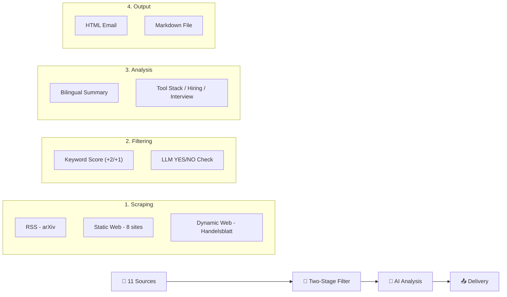

# 🏭 Industrial AI & Simulation Intelligence System

[🇨🇳 中文文档](#中文介绍) | [🇬🇧 English Documentation](#english-documentation)

---

## <a id="中文介绍"></a>🇨🇳 中文介绍

**Industrial AI & Simulation Intelligence System** 是一个自动化的工业技术情报采集、分析与推送系统。它专为**工业 AI**、**离散事件仿真 (DES)**、**数字孪生 (Digital Twin)** 和 **智能制造** 领域设计，每日自动从全球（特别是德国）顶级工业源获取最新资讯，并通过 AI 进行深度分析。

### 🚀 核心功能

*   **多源采集**：自动抓取 **11** 个高质量信息源（详见[数据源清单](#-数据源清单)）
*   **二级筛选**：关键词评分 + AI 语义验证双重过滤（详见[筛选机制](#-筛选机制)）
*   **AI 深度分析**（面向求职者/学生）：
    *   🌐 **双语摘要**：中英文标题与核心摘要
    *   🛠️ **工具链追踪**：识别文中提到的工业软件（AnyLogic, Plant Simulation, OPC UA 等）
    *   💼 **招聘信号**：捕捉企业扩建/新项目/招聘需求
    *   💡 **面试谈资**：提炼「痛点 → 解决方案」的技术洞察
    *   📖 **学术 vs 工业**：对比教科书理论与实际落地的差异
*   **多渠道交付**：HTML 邮件推送 + 本地 Markdown 报告
*   **多模型支持**：NVIDIA NIM / Moonshot Cloud / **本地 Ollama**（完全离线）
*   **全自动运行**：GitHub Actions 每日定时触发

---

### 📡 数据源清单

系统从以下 **11 个信息源**采集数据，分为三个优先级：

| 优先级 | 来源名称 | 类型 | 语言 | 分类 | URL |
|:---:|---|:---:|:---:|:---:|---|
| ⭐⭐⭐ | **Plattform Industrie 4.0** | 静态网页 | 🇩🇪 DE | 政策 | plattform-i40.de |
| ⭐⭐⭐ | **Fraunhofer IPA** | 静态网页 | 🇩🇪 DE | 研究 | ipa.fraunhofer.de |
| ⭐⭐⭐ | **DFKI** | 静态网页 | 🇩🇪 DE | 研究 | dfki.de |
| ⭐⭐⭐ | **TUM fml (物流)** | 静态网页 | 🇬🇧 EN | 研究 | mec.ed.tum.de/fml |
| ⭐⭐ | **SimPlan** | 静态网页 | 🇬🇧 EN | 工业 | simplan.de |
| ⭐⭐ | **Siemens Digital Industries** | 静态网页 | 🇬🇧 EN | 工业 | siemens.com |
| ⭐⭐ | **VDI Nachrichten** | 静态网页 | 🇩🇪 DE | 工业 | vdi-nachrichten.com |
| ⭐⭐ | **de:hub Smart Systems** | 静态网页 | 🇬🇧 EN | 工业 | de-hub.de |
| ⭐ | **arXiv cs.AI** | RSS | 🇬🇧 EN | 学术 | arxiv.org/rss/cs.AI |
| ⭐ | **arXiv cs.SY** | RSS | 🇬🇧 EN | 学术 | arxiv.org/rss/cs.SY |
| ⭐ | **Handelsblatt Tech** | 动态网页 | 🇩🇪 DE | 工业 | handelsblatt.com |

> **采集方式说明**：
> - **RSS**：通过 `feedparser` 解析 RSS/Atom 订阅源
> - **静态网页**：通过 `requests` + `BeautifulSoup` 解析 HTML
> - **动态网页**：通过 `Playwright` 无头浏览器渲染 JavaScript 页面

---

### 🔎 筛选机制

系统采用 **二级筛选** 策略，确保只有高价值内容进入 AI 分析环节：

#### 第一级：关键词评分（Keyword Scoring）

对每篇文章的**标题 + 内容摘要**进行关键词匹配，计算相关性得分。得分 ≥ 1 的文章进入下一级。

| 权重 | 关键词类别 | 具体关键词 |
|:---:|---|---|
| **+2** | 🔴 高优先级 | `Ablaufsimulation`（流程仿真）, `Fertigungssteuerung`（生产控制）, `Virtuelle Inbetriebnahme` / `VIBN`（虚拟调试）, `KI-gestützte Optimierung`（AI优化）, `KI-gestützte Fertigung`（AI制造）, `Diskrete Ereignissimulation`（离散事件仿真）, `Discrete Event Simulation`, `Digital Twin` / `Digitaler Zwilling`, `Asset Administration Shell` / `Verwaltungsschale`（AAS 管理壳） |
| **+1** | 🟡 中优先级 | `Smart Factory` / `Intelligente Fabrik`, `Predictive Maintenance` / `Vorausschauende Wartung`, `Reinforcement Learning`, `Multi-Agent System`, `Cyber-Physical Systems`, `Materialfluss`（物料流）, `Logistiksimulation`（物流仿真）, `Industrie 4.0` / `Industry 4.0`, `AnyLogic`, `Tecnomatix`, `Plant Simulation`, `Siemens`, `Omniverse` |

**计分示例**：
```
文章标题: "Digital Twin for Predictive Maintenance in Smart Factory"
  +2 (Digital Twin)  +1 (Predictive Maintenance)  +1 (Smart Factory)
  → 总分: 4 ✅ 通过 (≥1)
```

#### 第二级：AI 语义验证（LLM Validation）

通过 Kimi 模型进一步确认文章是否真正属于工业 AI / 仿真领域：
- 向模型发送文章标题和摘要片段
- 模型回答 `YES` 或 `NO`
- 可通过 `--skip-llm-filter` 跳过此步骤（节省 API 调用）

```
Stage 1: 103 篇文章 → 关键词筛选 → 9 篇通过
Stage 2: 9 篇 → AI 验证 → 9 篇确认
Stage 3: 9 篇 → 深度分析 → 9 篇日报
```

---

### 🧠 AI 分析维度

每篇通过筛选的文章将被 AI 分析为以下维度：

| 维度 | 说明 | 示例 |
|---|---|---|
| 📂 类别标签 | Digital Twin / Industry 4.0 / Simulation / AI / Research | `Industry 4.0` |
| 🇨🇳 中文标题 | 文章的中文翻译标题 | 工业4.0平台标准 |
| 🇬🇧 英文标题 | 原始或翻译的英文标题 | Industrie 4.0 Standards |
| 🔬 核心技术 | 关键技术创新点 | RAMI 4.0, CPS, OPC UA |
| 🏭 应用背景 | 涉及的德国企业/机构 | Fraunhofer IPA, BMWK |
| 🛠️ 工具链 | 提到的软件工具 | Plant Simulation, AnyLogic |
| 💼 招聘信号 | 企业扩建/招聘需求 | Siemens 扩建 AI 研发中心 |
| 💡 面试谈资 | 痛点 → 解决方案 | 数据孤岛 → AAS 标准化 |
| 📖 学术差异 | 理论 vs 工业实践 | 理想架构 vs 遗留系统改造 |

---

### 🛠️ 快速开始

#### 1. 环境准备

```bash
# 克隆仓库
git clone https://github.com/xuebai12/industrial-ai-news.git
cd industrial-ai-news

# 创建虚拟环境
python -m venv .venv
source .venv/bin/activate

# 安装依赖
pip install -e ".[dev]"

# 安装浏览器驱动 (用于动态网页抓取)
playwright install
```

#### 2. 配置 AI 模型

复制配置模板并选择一种 AI 模型：

```bash
cp .env.example .env
```

在 `.env` 中选择 **一种** 模型配置：

| 方案 | 环境变量 | 说明 |
|---|---|---|
| 🏠 **本地 Ollama** (推荐) | `USE_LOCAL_OLLAMA=true` + `OLLAMA_MODEL=kimi-k2.5:cloud` | 免费、完全离线 |
| ☁️ **NVIDIA NIM** | `NVIDIA_API_KEY=nvapi-xxx` | 满血版 Kimi K2.5 |
| ☁️ **Moonshot** | `MOONSHOT_API_KEY=sk-xxx` | Moonshot 官方 API |

#### 3. 配置邮件 (可选)

```bash
SMTP_HOST=smtp.gmail.com
SMTP_PORT=587
SMTP_USER=your@gmail.com
SMTP_PASS=xxxx xxxx xxxx xxxx  # Gmail 应用专用密码
EMAIL_TO=recipient@gmail.com
EMAIL_FROM=your@gmail.com
```

> **提示**：Gmail 需要开启两步验证并生成[应用专用密码](https://myaccount.google.com/apppasswords)。

#### 4. 运行

```bash
# ⚡ 激活虚拟环境 (每次运行前必须执行)
source .venv/bin/activate

# 🚀 生成 Markdown 日报 (推荐首次尝试)
python main.py --output markdown --skip-dynamic --skip-llm-filter

# � 生成日报并发送邮件
python main.py --output email --skip-dynamic --skip-llm-filter

# 🧪 测试模式 (不消耗 API，仅抓取和过滤)
python main.py --dry-run --skip-llm-filter

# 🧪 模拟模式 (无需 API Key，生成假数据)
python main.py --mock --output markdown
```

**命令参数说明**：

| 参数 | 说明 |
|---|---|
| `--output markdown` | 仅保存 Markdown 文件到 `output/` |
| `--output email` | 保存文件 + 发送邮件 |
| `--skip-dynamic` | 跳过需要浏览器渲染的动态网页（加快速度） |
| `--skip-llm-filter` | 跳过 AI 语义验证（仅用关键词筛选） |
| `--dry-run` | 仅抓取和过滤，不进行 AI 分析 |
| `--mock` | 使用模拟数据，不调用 AI API |
| `--max-articles N` | 每个源最多抓取 N 篇文章 |

---

## <a id="english-documentation"></a>🇬🇧 English Documentation

**Industrial AI & Simulation Intelligence System** is an automated pipeline for gathering, analyzing, and delivering intelligence on **Industrial AI**, **Discrete Event Simulation (DES)**, **Digital Twin**, and **Smart Manufacturing** — with a focus on the German market.

### 🚀 Key Features

*   **11 Premium Sources**: German research institutes, industry leaders, and global academic feeds
*   **Two-Stage Filtering**: Keyword scoring + LLM semantic validation
*   **Career-Oriented AI Analysis**: Tool stacks, hiring signals, interview insights, theory-vs-practice gaps
*   **Multi-Model Support**: NVIDIA NIM / Moonshot Cloud / **Local Ollama** (fully offline)
*   **Multi-Channel Delivery**: HTML Email + Markdown reports
*   **Fully Automated**: Daily runs via GitHub Actions

### 📡 Data Sources

| Priority | Source | Type | Language | Category |
|:---:|---|:---:|:---:|:---:|
| ⭐⭐⭐ | Plattform Industrie 4.0 | Web | DE | Policy |
| ⭐⭐⭐ | Fraunhofer IPA | Web | DE | Research |
| ⭐⭐⭐ | DFKI | Web | DE | Research |
| ⭐⭐⭐ | TUM fml (Logistics) | Web | EN | Research |
| ⭐⭐ | SimPlan | Web | EN | Industry |
| ⭐⭐ | Siemens Digital Industries | Web | EN | Industry |
| ⭐⭐ | VDI Nachrichten | Web | DE | Industry |
| ⭐⭐ | de:hub Smart Systems | Web | EN | Industry |
| ⭐ | arXiv cs.AI | RSS | EN | Research |
| ⭐ | arXiv cs.SY | RSS | EN | Research |
| ⭐ | Handelsblatt Tech | Dynamic | DE | Industry |

### 🔎 Filtering Pipeline

```
103 articles scraped
    ↓ Stage 1: Keyword Scoring (threshold ≥ 1)
9 articles passed
    ↓ Stage 2: LLM Semantic Validation (optional)
9 articles confirmed
    ↓ Stage 3: Deep AI Analysis
9 articles in daily digest
```

**Keyword Weights:**
- **+2 points** (High Priority): `Discrete Event Simulation`, `Digital Twin`, `Ablaufsimulation`, `VIBN`, `AAS`, `Verwaltungsschale`, etc.
- **+1 point** (Medium Priority): `Industry 4.0`, `Smart Factory`, `Reinforcement Learning`, `Plant Simulation`, `AnyLogic`, `Siemens`, etc.

### 🛠️ Quick Start

```bash
# Clone & Setup
git clone https://github.com/xuebai12/industrial-ai-news.git
cd industrial-ai-news
python -m venv .venv && source .venv/bin/activate
pip install -e ".[dev]"

# Configure (choose one AI model)
cp .env.example .env
# Edit .env: set USE_LOCAL_OLLAMA=true or NVIDIA_API_KEY=...

# Run
python main.py --output markdown --skip-dynamic --skip-llm-filter
```

### 🏗️ Architecture



### 📄 License
MIT License
