# 🏭 Industrial AI News Pipeline

> Automated intelligence pipeline that scrapes, filters, and analyzes Industrial AI news from 11 German & global sources — powered by local LLM (Ollama) and delivered daily via email.

[](https://github.com/xuebai12/industrial-ai-news/actions)

## What It Does

```
11 Sources → Scrape 100+ articles → Keyword Filter → LLM Analysis → Email Digest
```

Every day, this pipeline automatically:
1. **Scrapes** 11 premium data sources (RSS, static & dynamic web pages)
2. **Filters** articles using a two-stage system (keyword scoring + LLM validation)
3. **Analyzes** each article with a local AI model, extracting bilingual summaries, tool stacks, hiring signals, and interview-ready insights
4. **Delivers** a formatted HTML email digest and Markdown report

## Tech Stack

| Layer | Technology |
|---|---|
| Language | Python 3.11 |
| Scraping | `requests`, `BeautifulSoup`, `feedparser`, `Playwright` |
| AI/LLM | Ollama (local) / NVIDIA NIM / Moonshot API via OpenAI SDK |
| Delivery | SMTP (Gmail), Markdown |
| Automation | macOS LaunchAgent (local) / GitHub Actions (cloud) |
| Data | JSON-based rating storage with analytics |

## Data Sources

| Priority | Source | Type | Focus |
|:---:|---|:---:|---|
| ⭐⭐⭐ | Plattform Industrie 4.0 | Web | German I4.0 policy & AAS standards |
| ⭐⭐⭐ | Fraunhofer IPA | Web | Applied manufacturing research |
| ⭐⭐⭐ | DFKI | Web | AI research (Germany) |
| ⭐⭐⭐ | TUM fml | Web | Logistics & material flow |
| ⭐⭐ | SimPlan | Web | Plant simulation consulting |
| ⭐⭐ | Siemens Digital Industries | Web | Industrial automation |
| ⭐⭐ | VDI Nachrichten | Web | German engineering news |
| ⭐⭐ | de:hub Smart Systems | Web | German innovation hubs |
| ⭐ | arXiv cs.AI | RSS | AI & reinforcement learning papers |
| ⭐ | arXiv cs.SY | RSS | Systems & control papers |
| ⭐ | Handelsblatt Tech | Dynamic | German business tech news |

## Filtering Pipeline

### Stage 1: Keyword Scoring
Each article is scored against domain-specific keywords in **German and English**:

| Weight | Keywords (examples) |
|:---:|---|
| **+2** | `Discrete Event Simulation`, `Digital Twin`, `Ablaufsimulation`, `VIBN`, `Asset Administration Shell (AAS)` |
| **+1** | `Industry 4.0`, `Smart Factory`, `Reinforcement Learning`, `Plant Simulation`, `AnyLogic`, `Cyber-Physical Systems` |

Articles scoring **≥ 1** pass to the next stage.

### Stage 2: LLM Semantic Validation (Optional)
A lightweight LLM call confirms relevance with a YES/NO answer. Can be skipped with `--skip-llm-filter`.

## AI Analysis Output

Each article is analyzed into **9 structured dimensions**:

| Dimension | Description |
|---|---|
| 📂 Category | Digital Twin / Industry 4.0 / Simulation / AI / Research |
| 🇨🇳🇬🇧 Bilingual Title | Chinese + English titles |
| 📝 Bilingual Summary | One-sentence summaries in both languages |
| 🔬 Core Tech | Key technical innovations |
| 🏭 German Context | Companies, institutes, and market background |
| 🛠️ Tool Stack | Software tools mentioned (AnyLogic, OPC UA, etc.) |
| 💼 Hiring Signals | Expansion, new projects, talent demand |
| 💡 Interview Insights | Pain Point → Solution pairs |
| 📖 Theory vs Practice | Academic assumptions vs real-world constraints |

## Quick Start

```bash
# Clone & setup
git clone https://github.com/xuebai12/industrial-ai-news.git
cd industrial-ai-news
python -m venv .venv && source .venv/bin/activate
pip install -e ".[dev]"

# Configure
cp .env.example .env
# Edit .env: set USE_LOCAL_OLLAMA=true (or NVIDIA_API_KEY for cloud)

# Run
python main.py --output email --skip-dynamic --skip-llm-filter
```

### Configuration Options

| Option | Description |
|---|---|
| `USE_LOCAL_OLLAMA=true` | Use local Ollama model (free, offline) |
| `NVIDIA_API_KEY=nvapi-...` | Use NVIDIA NIM cloud API |
| `MOONSHOT_API_KEY=sk-...` | Use Moonshot cloud API |

### CLI Arguments

| Flag | Description |
|---|---|
| `--output markdown` | Save Markdown report only |
| `--output email` | Save report + send email |
| `--skip-dynamic` | Skip Playwright-based scrapers (faster) |
| `--skip-llm-filter` | Use keyword filtering only (no LLM cost) |
| `--dry-run` | Scrape & filter only, no AI analysis |
| `--mock` | Generate mock data (no API needed) |

## Architecture

```mermaid
graph LR
    A[📡 11 Sources] --> B[🔎 Two-Stage Filter]
    B --> C[🧠 Local LLM Analysis]
    C --> D[📤 Email + Markdown]

    subgraph Scraping
    A1[RSS Feeds]
    A2[Static Web ×8]
    A3[Dynamic Web ×1]
    end

    subgraph Filtering
    B1["Keyword Score (+2/+1)"]
    B2[LLM YES/NO Validation]
    end

    subgraph Analysis
    C1[Bilingual Summary]
    C2[Tool Stack + Hiring Signals]
    end

    subgraph Delivery
    D1[HTML Email]
    D2[Markdown Report]
    end
```



## Automation

**Local (macOS):** Runs daily at 9:30 AM via LaunchAgent — just keep your Mac on.

```bash
# One-click manual run
./run_daily.sh
```

**Cloud (GitHub Actions):** Runs daily at 08:00 CET — requires cloud API key.

## License
MIT
